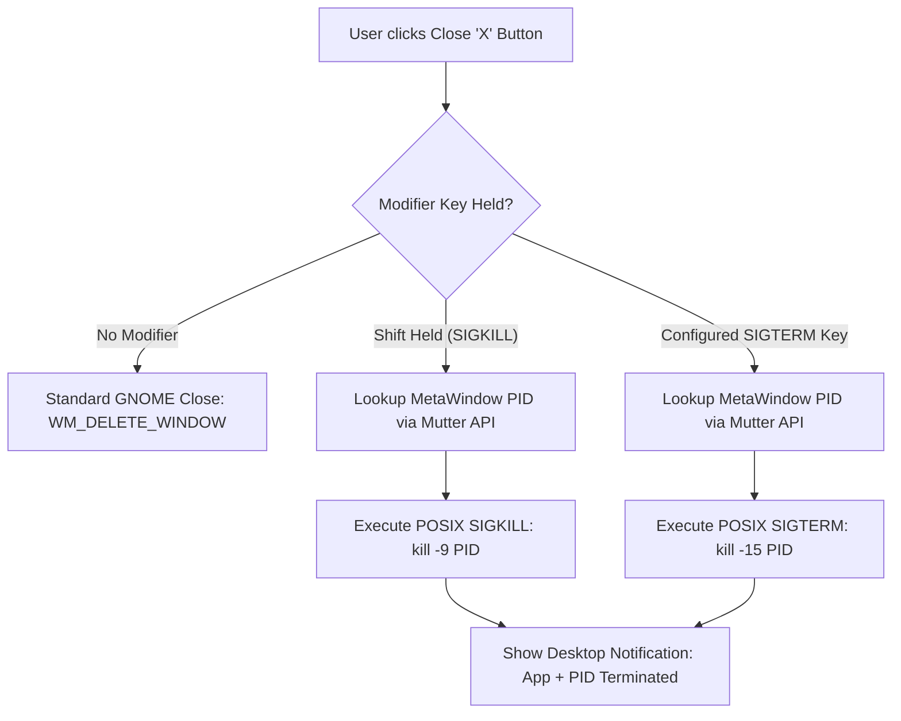

# ForceQuit GNOME Shell Extension

[](https://gjs.guide/extensions/)
[](https://www.gnu.org/licenses/gpl-3.0)
[](https://gnome.pages.gitlab.gnome.org/libadwaita/)

**ForceQuit** is a lightweight, responsive GNOME Shell extension that enables instant process termination (`SIGKILL` / `kill -9` or graceful `SIGTERM`) when clicking a window's close button while holding a configurable modifier key (by default, **Shift**).

When an application freezes or enters an infinite loop, standard window managers send a `WM_DELETE_WINDOW` client message which is ignored by unresponsive event loops. **ForceQuit** intercepts the close action directly in GNOME Shell, detects the process PID via Mutter/MetaWindow, and terminates the offending process immediately with zero system lag.

---

## Table of Contents
- [Features](#features)
- [How It Works](#how-it-works)
- [System Requirements](#system-requirements)
- [Quick Installation](#quick-installation)
- [Manual Installation & Build](#manual-installation--build)
- [Preferences & Customization](#preferences--customization)
- [Usage Guide](#usage-guide)
- [Reloading GNOME Shell](#reloading-gnome-shell)
- [Project Structure](#project-structure)
- [Troubleshooting](#troubleshooting)
- [License](#license)

---

## Features

- ⚡ **Instant SIGKILL (`kill -9`)**: Immediately destroys unresponsive and frozen processes without waiting for timeout dialogs.
- 🟡 **Optional Graceful SIGTERM (`kill -15`)**: Configurable modifier to request graceful termination.
- 🔴 **Visual Glow Feedback**: Window close buttons glow red (or your custom chosen color) when the modifier key is held, indicating that Force Kill mode is armed.
- 🪟 **Dual Context Support**: Works directly on window titlebar close buttons and within GNOME Shell Overview window preview cards (`WindowPreview`).
- 🔔 **Desktop Notifications**: Displays a toast notification detailing the terminated application name and its PID.
- ⚙️ **LibAdwaita Preferences GUI**: Native GTK4/Adw configuration panel with interactive key remapping and RGBA color pickers.
- 🐧 **Universal Linux Compatibility**: Supports GNOME Shell 45 through 50+ on Wayland and X11 across Fedora, Ubuntu, Arch Linux, Debian, openSUSE, and more.

---

## How It Works



---

## System Requirements

- **Desktop Environment**: GNOME Shell 45, 46, 47, 48, 49, or 50+
- **Display Server**: Wayland or X11
- **Tools**:
  - `glib-compile-schemas` (included in `glib2` / `libglib2.0-bin`)
  - `gnome-extensions` CLI tool (standard on GNOME)

---

## Quick Installation

Run the included universal installer script in the repository root:

```bash
cd ForceQuit
chmod +x install.sh
./install.sh
```

The script automatically:
1. Compiles the GSettings schema (`schemas/gschemas.compiled`).
2. Copies all extension files to `~/.local/share/gnome-shell/extensions/forcequit@schirelli.github.io/`.
3. Enables the extension via `gnome-extensions enable forcequit@schirelli.github.io`.

---

## Manual Installation & Build

If you prefer installing manually or packaging the extension as a `.zip` artifact:

### 1. Compile Schema
```bash
cd ForceQuit
glib-compile-schemas schemas/
```

### 2. Copy to Extensions Directory
```bash
UUID="forcequit@schirelli.github.io"
TARGET_DIR="$HOME/.local/share/gnome-shell/extensions/$UUID"

mkdir -p "$TARGET_DIR"
cp -r metadata.json extension.js prefs.js stylesheet.css icon.png icon.svg icons schemas "$TARGET_DIR/"
```

### 3. Enable Extension
```bash
gnome-extensions enable forcequit@schirelli.github.io
```

### 4. (Optional) Create Distribution Zip
```bash
gnome-extensions pack --force \
  --extra-source=icons \
  --extra-source=icon.png \
  --extra-source=icon.svg \
  --extra-source=stylesheet.css \
  --extra-source=schemas
```

---

## Preferences & Customization

Open the settings window using the GNOME Extensions app or CLI:
```bash
gnome-extensions prefs forcequit@schirelli.github.io
```

### Available Settings

| Setting | Default Value | Description |
| :--- | :--- | :--- |
| **SIGKILL Modifier Key** | `Shift_L` (`65505`) | Key to hold while clicking close button to send `SIGKILL` (`kill -9`). |
| **SIGKILL Glow Color** | `#e60000` (Red) | Glow highlight color when force kill mode is armed. |
| **SIGTERM Modifier Key** | `None` (`0`) | Optional key to hold to send graceful `SIGTERM` (`kill -15`). |
| **SIGTERM Glow Color** | `#e68a00` (Amber) | Glow highlight color when graceful kill mode is armed. |
| **Enable Notifications** | `true` | Show desktop notification toast with application name & PID. |

---

## Usage Guide

1. **Normal Close**:
   - Click the **X** button normally → The window requests a standard graceful shutdown.
2. **Force Kill (`SIGKILL`)**:
   - Hold **Shift** (or your configured hotkey).
   - The close button turns **red**.
   - Click the **X** button → The process is killed immediately via `kill -9`.
3. **Overview Mode**:
   - Press the `Super` (Windows) key to open Overview.
   - Hold **Shift** and click the **X** on any window card thumbnail to force kill it.

---

## Reloading GNOME Shell

Because GNOME Shell discovers newly registered extension directories at startup, reload your session once after initial installation:

- **On Wayland**: Log out and log back into your user session.
- **On X11**: Press `Alt + F2`, type `r`, and press `Enter`.

---

## Project Structure

```text
ForceQuit/
├── metadata.json           # Extension manifest (UUID, version, shell compatibility)
├── extension.js            # Core extension lifecycle & Mutter window hooking
├── prefs.js                # LibAdwaita / GTK4 preferences window
├── stylesheet.css          # Visual styling & glow animations
├── install.sh              # Universal installation script
├── README.md               # User & developer guide
├── schemas/                # GSettings XML schema definition
│   ├── org.gnome.shell.extensions.forcequit.gschema.xml
│   └── gschemas.compiled   # Compiled binary schema cache
├── icons/                  # Symbolic vector icons
│   └── target-close.svg
├── icon.png                # Extension store icon (PNG)
└── icon.svg                # Extension store icon (SVG)
```

---

## Troubleshooting

- **Close button does not glow:** Verify that `stylesheet.css` is installed and that the modifier key in Preferences matches the key you are pressing.
- **Extension not showing in GNOME Extensions list:** Ensure you have reloaded GNOME Shell (log out / log in on Wayland, or `Alt+F2` -> `r` on X11).
- **Process did not terminate:** Certain kernel-locked processes (uninterruptible sleep / `D` state due to NFS/I/O lock) cannot be reaped by `SIGKILL`. Normal userland processes and frozen browser tabs will terminate immediately.

---

## License

This project is licensed under the **GNU General Public License v3.0 (GPL-3.0)**.
